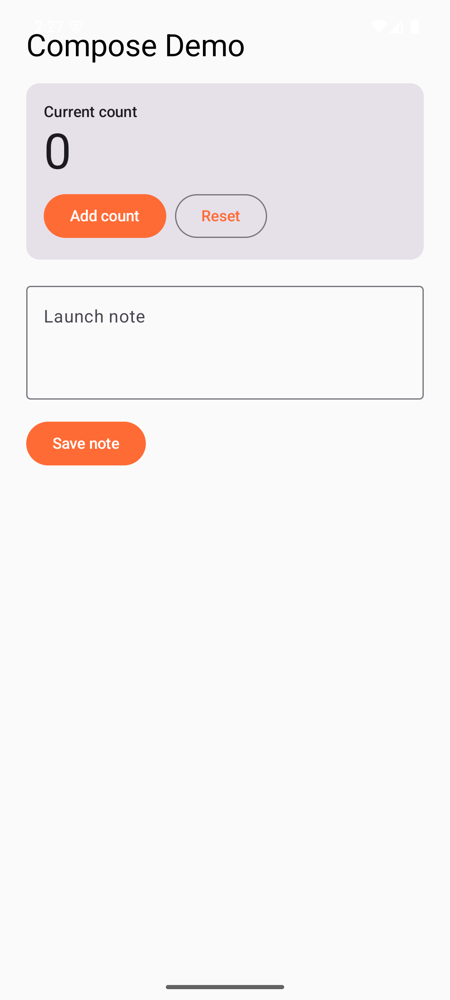
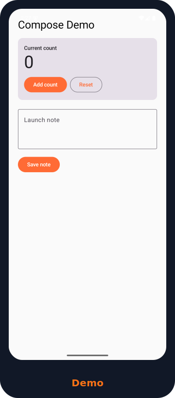

# 🍯 HoneyPie

**The AI-native publishing pipeline for mobile applications.**

HoneyPie takes a mobile app repository — Flutter, native Android/Kotlin, Jetpack Compose, React Native, Ionic, Expo — and automatically produces a complete, ready-to-publish marketing asset package: screenshots, device mockups, Play Store and App Store graphics, README images, website hero images, social media assets, press kits, and an interactive HTML report explaining every decision it made.

```
cd my-app
honeypie
```

That's the entire workflow. No manual screenshots. No manual cropping. No manual mockup design. No manually written store copy.

## Why HoneyPie

Every mobile developer eventually hits the same wall: the app works, but shipping it means hours of screenshot-taking, Figma mockup wrangling, copywriting, and asset exporting — none of which has anything to do with building software. HoneyPie treats that wall as an automation problem, not a design problem, and solves it with an AI-first pipeline: an autonomous exploration engine that drives the app like a curious QA tester, a vision engine that judges screenshots the way a designer would, and a copywriting engine that writes like a product marketer who actually understands the app.

## Status

Phase 1 implementation has started. The repository now contains the full engineering specification plus a pnpm/Turborepo TypeScript monorepo with two working pipelines:

- `@honeypie/core`: config loading, typed errors, plugin registry, checkpointed orchestrator, deterministic local AI gateway, and a minimal local-only (synthetic) pipeline for frameworks without a real backend yet.
- **Real native Android/Compose pipeline** (`honeypie run --yes --android-native`): builds the app with Gradle, installs and launches it on an attached device or emulator, explores it with a deterministic `uiautomator`-driven breadth-first crawl, captures real screenshots via `adb screencap`, and renders them into device-frame mockups — no placeholders.
- `@honeypie/cli`: `honeypie run --yes --local-only`, `honeypie run --yes --android-native`, `honeypie doctor`, and `honeypie config init`.
- `@honeypie/plugin-sdk`: initial public plugin interfaces.
- `examples/flutter-counter-plus` and `examples/android-compose-demo`: fixture apps used for testing both pipelines.

Real screenshot and mockup output, captured end-to-end from `examples/android-compose-demo` running on a live Android emulator:

<p>
  
  
</p>

Flutter support, AI-driven exploration/copywriting, and vision-based screenshot scoring are still unimplemented — the Android-native pipeline above uses deterministic (non-AI) logic throughout. `honeypie doctor` reports missing local Android tooling clearly when ADB/emulator are not available.

The current local-only run also writes `dist/readme/hero.svg` and updates the target repository's `README.md` inside a guarded block; the Android-native pipeline does the same with a real mockup instead:

```md
<!-- honeypie:start -->
...
<!-- honeypie:end -->
```

Repeated runs replace only that block.

### Desktop installer

`apps/desktop` is a one-click Windows installer (`.msi`, built with [Tauri](https://tauri.app)) that bundles a portable Node.js runtime as a sidecar, so end users need **no Node, pnpm, or Rust installed** — pick a project folder, click Run, get a real `dist/`. It always runs the local-only pipeline, which has no external dependencies; the Android-native pipeline still needs the Android SDK/emulator on the machine, which no installer can bundle away. See `apps/desktop/README.md` for build instructions. Verified: real MSI build, payload extraction, and the exact bundled Node+CLI producing real output — installing per-machine MSIs requires Administrator privileges on Windows, which is standard for the format, not specific to this app.

## Quick Start

```bash
pnpm install
pnpm build
node packages/cli/dist/bin.js run --yes --local-only --dest dist
```

For the real Android pipeline, attach a device or start an emulator first (`adb devices` should list it), then run from the Android project directory:

```bash
cd examples/android-compose-demo
node ../../packages/cli/dist/bin.js run --yes --android-native --dest dist
```

Try the fixture apps by running the CLI from the target app directory:

```bash
cd examples/flutter-counter-plus
node ../../packages/cli/dist/bin.js run --yes --local-only --dest dist
```

## For Contributors

HoneyPie is intentionally plugin-first. Good first contribution areas are framework detectors, local-only scoring heuristics, fixture app improvements, and report/export polish. See `TASKS.md` for Phase 1 scope and `docs/04-repository-layout.md` for package boundaries.

## Documentation Map

| Document | Purpose |
|---|---|
| `docs/01-vision.md` | Why HoneyPie exists, what success looks like |
| `docs/02-product-requirements.md` | Functional and non-functional requirements |
| `docs/03-architecture.md` | System architecture, module boundaries |
| `docs/04-repository-layout.md` | Monorepo structure |
| `docs/05-cli-specification.md` | `honeypie` command surface |
| `docs/06-tui-specification.md` | Terminal UI design and wireframes |
| `docs/07-plugin-sdk.md` | Plugin architecture and lifecycle |
| `docs/08-ai-architecture.md` | LLM/VLM provider abstraction |
| `docs/09-vision-pipeline.md` | Screenshot scoring and selection |
| `docs/10-exploration-engine.md` | Autonomous app exploration |
| `docs/11-renderer-architecture.md` | Mockup and asset rendering |
| `docs/12-export-pipeline.md` | `dist/` generation |
| `docs/13-template-system.md` | Theming and templates |
| `docs/14-html-report-spec.md` | Interactive report |
| `docs/15-configuration-system.md` | `honeypie.config` schema |
| `docs/16-benchmarking-strategy.md` | Performance benchmarks |
| `docs/17-testing-strategy.md` | Test pyramid and fixtures |
| `docs/18-security-considerations.md` | Threat model |
| `docs/19-performance-goals.md` | SLOs and budgets |
| `docs/20-coding-standards.md` | Style, linting, conventions |
| `docs/21-contribution-guide.md` | How to contribute |
| `docs/22-release-process.md` | Versioning and release cadence |
| `docs/23-milestone-roadmap.md` | Phased delivery plan |
| `docs/24-decision-log.md` | ADR-style decisions |
| `docs/25-glossary.md` | Terminology |
| `docs/26-future-ideas.md` | Post-v1 exploration |
| `docs/27-dogfood-targets.md` | Real projects used for dogfood testing |

## Installation (target)

```bash
npm install -g honeypie
# or
cargo install honeypie
# or
brew install honeypie
```

See `docs/22-release-process.md` for why the initial distribution channel is npm, with Cargo/Homebrew as later targets.

## License

See `LICENSE.md` (placeholder — license to be finalized before first public release).

## Contributing

See `CONTRIBUTING.md`.
