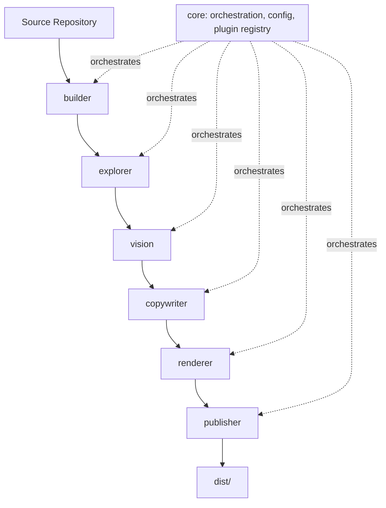
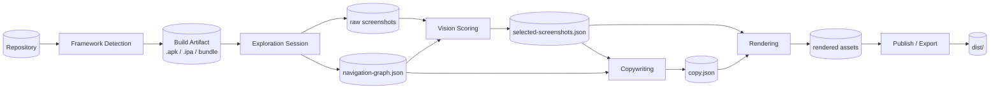

# 03 — Architecture

## System Overview

HoneyPie is organized as a pipeline of independently testable stages, each implemented as a package with a stable interface, orchestrated by a core engine. Every stage other than `core` and `cli` is designed to be replaceable by a plugin.

## Design Goals

1. **Stage isolation.** Each stage consumes a well-defined input artifact and produces a well-defined output artifact, persisted to disk (see `docs/12-export-pipeline.md`). This means any stage can be re-run independently, cached, or replaced without re-running the whole pipeline.
2. **Plugin boundary = package boundary.** Every extensible surface (framework detector, exploration strategy, vision scorer, copy generator, render theme, export target) is a plugin implementing a TypeScript/Rust interface defined once in `core`, published as its own package.
3. **AI isolation.** All AI calls (LLM and VLM) go through a single `core/ai` gateway. No stage calls a provider SDK directly. This keeps provider-swapping, mocking for tests, redaction, and cost tracking centralized.
4. **State is inspectable.** The navigation graph, screenshot scores, and generated copy are all serialized to JSON at each stage boundary and are what feeds the HTML report — the report is not a separate "summary," it is a direct view onto pipeline state.

## Module Map

| Module | Responsibility | Depends on |
|---|---|---|
| `core` | Orchestration, config loading, plugin registry, AI gateway, logging | — |
| `cli` | Command parsing, non-interactive execution | `core` |
| `tui` | Interactive terminal UI | `core` |
| `builder` | Framework detection, build, install, device/emulator lifecycle | `core` |
| `explorer` | Autonomous UI graph traversal, screen state capture | `core`, `builder` |
| `vision` | Screenshot scoring, deduplication, selection | `core` |
| `copywriter` | Marketing copy generation | `core` |
| `renderer` | Mockup and store-asset image rendering | `core`, `templates` |
| `templates` | Theme definitions, layout primitives | — |
| `publisher` | `dist/` assembly, HTML report generation, ZIP export | `core`, `renderer` |
| `plugins` | First-party plugin implementations (framework detectors, themes, exporters) | `core` |

## Data Flow

## Orchestration Model

The core engine runs stages as a directed acyclic pipeline with explicit checkpoints. Each checkpoint writes its artifact to `.honeypie/cache/<stage>/` before the next stage begins, which enables:

- **Resumability** — a crashed or interrupted run can resume from the last successful checkpoint (`honeypie run --resume`).
- **Partial re-runs** — e.g., re-run only `copywriter` and `renderer` after editing `honeypie.config.json`'s tone setting, without re-exploring the app (`honeypie run --from copywriter`).
- **Cacheability in CI** — checkpoints keyed by a content hash of (app build hash + config hash) so unchanged apps skip exploration entirely.

## Concurrency Model

- `explorer` is inherently sequential per device (one exploration session drives one emulator), but multiple devices/emulators can run explorer sessions in parallel when multiple output form-factors are requested (e.g., phone + tablet).
- `vision` scoring is embarrassingly parallel across screenshots (bounded worker pool, see `docs/19-performance-goals.md`).
- `renderer` is embarrassingly parallel across (screenshot × theme × target) render jobs.
- `copywriter` batches LLM calls per screen where the provider supports batching, else runs bounded-concurrency single calls.

## Error Handling Philosophy

- A plugin failure is isolated: the orchestrator logs it, marks that plugin's output as unavailable, and continues the pipeline with whatever succeeded (e.g., if the "glass" theme plugin throws, other themes still render).
- A stage failure (e.g., build fails) halts the pipeline with a clear, actionable diagnostic — no silent partial `dist/`.
- All errors are captured in `dist/honeypie.json` under an `errors[]` array and surfaced in the HTML report, never only in a terminal log that disappears.

## Why Not a Monolithic Script

An early monolithic-script approach was considered and rejected — see `docs/24-decision-log.md#adr-001`.
