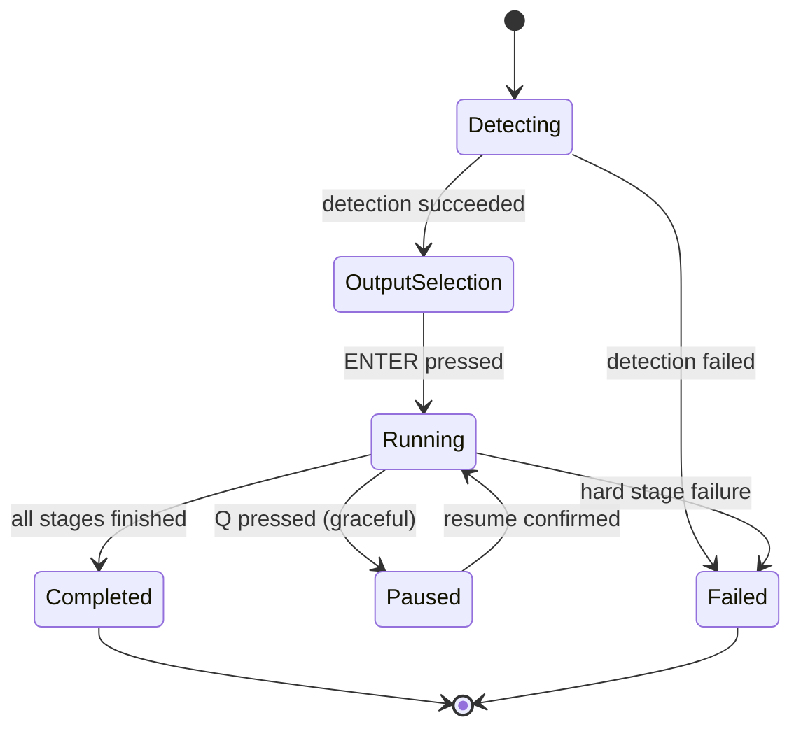

# 06 — Terminal UI Specification

## Technology

TUI is built on a component-based terminal framework (Ink for the TypeScript path, or Ratatui if the Rust core path is chosen — see `docs/24-decision-log.md#adr-002`). It must support keyboard navigation, mouse click/scroll, colored/styled output, and graceful degradation to plain-text logs when run in a non-TTY context (e.g., piped in CI, where the CLI JSON mode takes over instead — see `docs/05-cli-specification.md`).

## Screens

### 1. Project Detection Screen

```
🍯 HoneyPie

Project
────────────────────────────
✓ Flutter Project Detected
✓ Android Supported
✓ Package: com.vidyuthlabs.myapp
✓ App Name: MyApp

Press ENTER to continue, or C to configure
```

### 2. Output Selection Screen

```
🍯 HoneyPie — Choose outputs

  [x] Explore App
  [x] Capture Screens
  [x] Device Mockups
  [x] Play Store Assets
  [x] App Store Assets
  [x] README Images
  [x] Website Hero
  [x] Open Graph Images
  [x] Social Media Assets
  [ ] Promo Video          (coming soon)
  [ ] Marketing Website    (coming soon)

  Destination: dist/

  ↑↓ move   SPACE toggle   ENTER begin   Q quit
```

Selection state maps directly onto `docs/15-configuration-system.md`'s `outputs[]` config key, so a TUI run can be exported as a reusable non-interactive config via `S` (save config).

### 3. Pipeline Progress Screen

```
🍯 HoneyPie — Running

Building application...            ██████████ 100%
Launching emulator (Pixel_7_API_34) ██████████ 100%
Exploring application...           ██████░░░░  62%   [Detected 37 unique screens]
  └─ Currently on: SettingsScreen → NotificationsSubScreen
Scoring screenshots...             ░░░░░░░░░░   0%
Generating mockups...              ░░░░░░░░░░   0%
Rendering Play Store assets...     ░░░░░░░░░░   0%
Generating README...               ░░░░░░░░░░   0%

Elapsed: 02:14   Estimated remaining: ~04:30

[L] toggle live logs   [D] toggle screen detail   [Q] cancel (graceful)
```

Live log panel (toggle with `L`) is a collapsible pane showing structured log lines, filterable by stage.

### 4. Completion Screen

```
🍯 HoneyPie — Done!

✓ 37 screens explored
✓ 24 screenshots selected (61 captured, 37 rejected — see report)
✓ 7 mockup themes rendered
✓ Play Store, App Store, README, Website, Social assets exported

dist/
├── screenshots/     (24 files)
├── mockups/         (168 files)
├── playstore/       (12 files)
├── appstore/        (8 files)
├── website/         (5 files)
├── readme/          (6 files)
├── social/          (9 files)
├── press-kit/       (1 zip)
├── metadata/        (3 files)
├── report.html
└── honeypie.json

Open report:  honeypie report
Zip export:   honeypie export --zip
```

## Interaction Principles

- **Never block on a spinner with no context.** Every long-running step shows what it's doing (e.g., "Currently on: SettingsScreen") not just a bar.
- **Cancel is always available and graceful** — `Q` triggers a checkpointed stop, not a hard kill, so `--resume` works afterward.
- **Estimated remaining time** is computed from a rolling per-stage duration model seeded by `docs/16-benchmarking-strategy.md` baselines and corrected live.
- **Color semantics:** green = success, yellow = degraded/partial (e.g., a plugin failed but pipeline continued), red = hard failure, gray = pending/skipped.

## Accessibility

- All progress information is also emitted as structured JSON events (`--json`) so the TUI is not the only way to consume run state — screen-reader users and CI systems use the JSON stream.
- Color is never the sole signal — status also uses symbols (✓ ✗ ⚠ ░).

## State Machine


