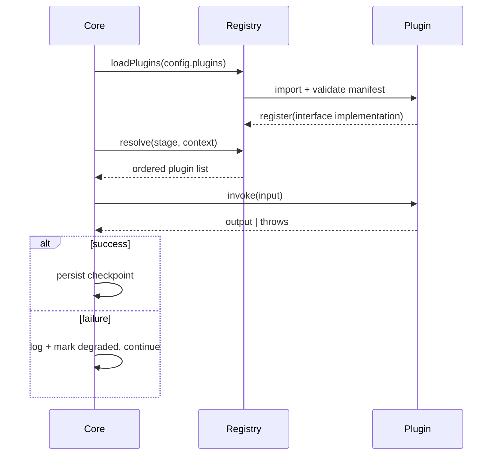

# 07 — Plugin SDK

## Philosophy

Every extensible surface in HoneyPie is a plugin implementing an interface exported from `plugin-sdk`. First-party plugins (in `plugins/*`) use the exact same interfaces as third-party plugins — there is no privileged internal API.

## Plugin Types

| Type | Interface | Discovers/Produces |
|---|---|---|
| `FrameworkDetector` | `detect(repoPath): DetectionResult \| null` | Framework, package name, app name, icon, build system |
| `ExplorationStrategy` | `explore(session): NavigationGraph` | Screen graph, transitions |
| `VisionScorer` | `score(screenshot, context): ScoreResult` | Quality score + rejection reason |
| `Copywriter` | `generate(context): CopyResult` | Headlines, captions, descriptions |
| `RenderTheme` | `render(screenshot, spec): RenderedAsset` | Mockup image |
| `ExportTarget` | `export(assets, context): ExportedBundle` | Store-specific asset bundle |

## Interface Definitions (TypeScript)

```ts
export interface FrameworkDetector {
  id: string;                       // e.g. "detector-flutter"
  priority: number;                 // higher runs first when multiple detectors match
  detect(repoPath: string): Promise<DetectionResult | null>;
}

export interface DetectionResult {
  framework: "flutter" | "android-native" | "react-native" | "ionic" | "expo" | string;
  packageName: string;
  appName: string;
  iconPath?: string;
  buildSystem: "gradle" | "flutter-cli" | "metro" | "eas" | string;
  platforms: ("android" | "ios")[];
  confidence: number;               // 0–1
}

export interface ExplorationStrategy {
  id: string;
  explore(session: DeviceSession, opts: ExploreOptions): Promise<NavigationGraph>;
}

export interface VisionScorer {
  id: string;
  score(shot: Screenshot, ctx: ScreenContext): Promise<ScoreResult>;
}

export interface ScoreResult {
  score: number;                    // 0–100
  dimensions: {
    visualQuality: number;
    clutter: number;
    readability: number;
    aesthetic: number;
  };
  rejected: boolean;
  rejectionReason?: "loading-state" | "empty-state" | "dialog-open" | "keyboard-visible" | "duplicate" | "low-quality" | string;
}

export interface Copywriter {
  id: string;
  generate(ctx: CopyContext): Promise<CopyResult>;
}

export interface RenderTheme {
  id: string;                       // e.g. "theme-glass"
  displayName: string;
  render(shot: SelectedScreenshot, spec: RenderSpec): Promise<RenderedAsset>;
}

export interface ExportTarget {
  id: string;                       // e.g. "export-playstore"
  requiredDimensions: AssetDimension[];
  export(assets: RenderedAsset[], ctx: ExportContext): Promise<ExportedBundle>;
}
```

## Plugin Lifecycle



## Plugin Manifest

Every plugin package includes a `honeypie-plugin.json`:

```json
{
  "id": "theme-glass",
  "type": "RenderTheme",
  "version": "1.2.0",
  "sdkVersion": "^1.0.0",
  "entry": "./dist/index.js",
  "displayName": "Glass",
  "description": "Frosted-glass background with soft device shadow"
}
```

## Distribution & Discovery

- Plugins are published as npm packages prefixed `honeypie-plugin-*`.
- `honeypie plugins add honeypie-plugin-theme-neon` installs and registers a plugin, writing it into `honeypie.config.json`'s `plugins[]` array.
- The core registry validates `sdkVersion` compatibility against the installed `plugin-sdk` version at load time and refuses to load incompatible plugins with a clear error, rather than failing deep in the pipeline.

## Testing Plugins

`plugin-sdk` ships a test harness (`@honeypie/plugin-test-kit`) providing fixture repos, fixture navigation graphs, and fixture screenshots so a `RenderTheme` or `VisionScorer` plugin can be unit-tested without running the full pipeline. See `docs/17-testing-strategy.md`.

## Versioning & Compatibility

The Plugin SDK follows semver strictly. A breaking change to any interface bumps the SDK major version; `core` supports at most two major SDK versions concurrently during a deprecation window (see `docs/22-release-process.md`).
