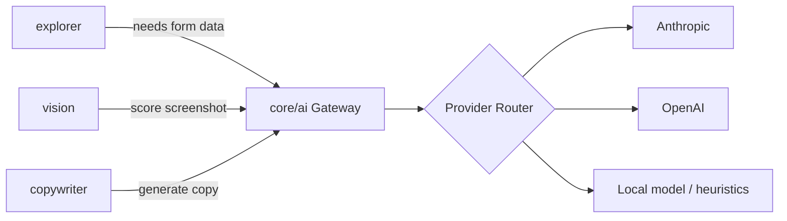

# 08 — AI Architecture

## Principle

All AI calls — LLM (text reasoning/copywriting) and VLM (vision judgment) — pass through a single `core/ai` gateway. No other package imports a provider SDK directly. This is the single most important architectural constraint for provider-agnosticism, cost tracking, redaction, mocking in tests, and enforcing the local-only mode.



## Gateway Responsibilities

1. **Provider abstraction.** A single `AIProvider` interface (`complete()`, `visionScore()`, `structuredOutput()`) implemented per vendor. Switching providers is a config change, not a code change.
2. **Structured output enforcement.** All copywriting and scoring calls request schema-constrained JSON output (JSON Schema / tool-call style), validated against a Zod schema before being trusted by downstream stages. Malformed output is retried once, then falls back to a deterministic heuristic (see below).
3. **Redaction.** Before any screenshot or text leaves the machine, the gateway strips configured PII patterns (from `honeypie.config.json`'s `redaction` rules) and can blur configured screen regions (e.g., a debug overlay) prior to sending to a vision provider.
4. **Cost & token tracking.** Every call is logged with token counts and estimated cost, aggregated into `dist/honeypie.json`'s `aiUsage` block, surfaced in the HTML report.
5. **Caching.** Identical (prompt hash + image hash) calls within a run are cached to avoid redundant spend, keyed in `.honeypie/cache/ai/`.
6. **Local-only mode.** When `--local-only` or `config.ai.mode = "local"` is set, the gateway routes all calls to deterministic/local heuristics instead of any network provider — see below.

## Where AI Is Used

| Use | Type | Fallback without AI |
|---|---|---|
| Detect plausible synthetic form data | LLM | Static fixture data (name/email/password patterns) |
| Screenshot quality scoring | VLM | Heuristic scorer: blur detection, histogram analysis, text-density via OCR, template-based dialog/loading-indicator detection |
| Screen "what is this" understanding | VLM + LLM | Label from navigation graph route name / accessibility tree only |
| Headline/subtitle/caption generation | LLM | Templated copy filled from extracted app facts (app name, screen labels) |
| Store description generation | LLM | Templated boilerplate description |

This fallback column is not optional — it is a requirement (see FR/NFR in `docs/02-product-requirements.md`): HoneyPie must produce *something* usable with zero AI configured, just of lower quality. This is core to the "zero-config for common case" principle and to the local-only enterprise mode.

## Provider Interface

```ts
export interface AIProvider {
  id: string;
  complete(req: CompletionRequest): Promise<CompletionResult>;
  structuredOutput<T>(req: StructuredRequest<T>): Promise<T>;
  visionScore(req: VisionScoreRequest): Promise<VisionScoreResult>;
  capabilities: {
    supportsVision: boolean;
    supportsStructuredOutput: boolean;
    maxImageSize: number;
  };
}
```

## Prompt Management

Prompts are not inline strings scattered through code — they live as versioned templates in `packages/core/ai/prompts/*.md` with typed input slots, so prompt changes are reviewable diffs and can be evaluated against a regression fixture set (see `docs/16-benchmarking-strategy.md`'s copy-quality benchmark).

## Model Selection Strategy

`honeypie.config.json` allows per-use-case model overrides:

```json
{
  "ai": {
    "provider": "anthropic",
    "models": {
      "vision": "claude-sonnet-5",
      "copywriting": "claude-sonnet-5",
      "formFill": "claude-haiku-4-5"
    },
    "mode": "cloud"
  }
}
```

Cheaper/faster models are used by default for high-volume, low-judgment calls (form filling across dozens of fields) while higher-capability models are used for judgment-heavy calls (screenshot scoring, headline writing).

## Determinism & Reproducibility

Where a provider supports a `seed` parameter, the gateway passes through `--seed` from the CLI. Where it doesn't, the gateway records the exact prompt + response pair so a run can be replayed offline from cache for debugging, even if not bit-reproducible against a live provider.
