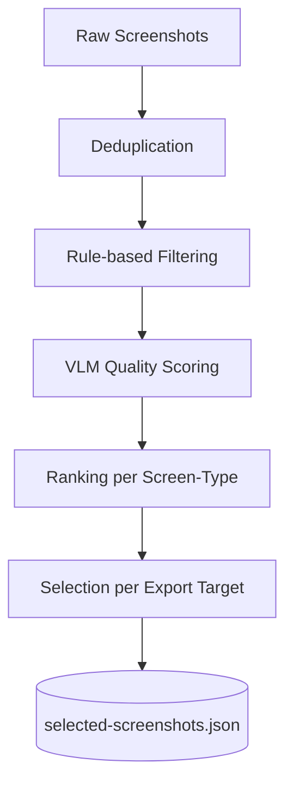

# 09 — Vision Pipeline

## Purpose

Turn a large pool of raw captures (potentially 100+ from an exploration session) into a small, curated set of publish-worthy screenshots per export target, with every rejection explainable.

## Pipeline Stages



### 1. Deduplication
Perceptual hashing (pHash) across all captures from the same graph node; near-duplicates (same screen, no meaningful visual delta) are collapsed to the single best-quality candidate before any AI scoring happens, to save cost.

### 2. Rule-Based Filtering (pre-AI, deterministic)
Cheap, deterministic checks run first and can reject without ever calling a VLM:
- Blank/solid-color frame (likely a transition artifact)
- Detected system permission dialog still on screen
- Detected on-screen keyboard covering >20% of viewport (configurable)
- Detected loading spinner via template match

### 3. VLM Quality Scoring
Surviving candidates are scored by the configured `VisionScorer` plugin across four dimensions:

| Dimension | What it captures |
|---|---|
| `visualQuality` | Sharpness, exposure/contrast, no rendering glitches |
| `clutter` | Information density vs. white space balance |
| `readability` | Text legibility, contrast ratios |
| `aesthetic` | Overall composition, color harmony |

Each dimension is 0–100; composite `score` is a configurable weighted sum (default equal-weighted). Full result includes `rejected: boolean` and a human-readable `rejectionReason`.

### 4. Ranking per Screen-Type
Screens are grouped by inferred type (home, detail, form, settings, empty-state, onboarding, etc. — inferred from navigation graph + VLM screen understanding from `docs/10-exploration-engine.md`). Within each group, candidates are ranked by score.

### 5. Selection per Export Target
Each `ExportTarget` plugin declares how many screenshots it needs and in what aspect ratio (e.g., Play Store phone screenshots: 2–8 images, 16:9 or 9:16). The selector greedily picks top-ranked, screen-type-diverse candidates to avoid an all-settings-screens result, cropping/padding to the target aspect ratio without AI (deterministic geometry).

## Data Schema — `selected-screenshots.json`

```json
{
  "screens": [
    {
      "screenId": "settings-notifications",
      "screenType": "settings",
      "capturedAt": "2026-07-01T02:11:04Z",
      "score": 87,
      "dimensions": { "visualQuality": 91, "clutter": 78, "readability": 93, "aesthetic": 86 },
      "rejected": false,
      "path": ".honeypie/cache/vision/settings-notifications-01.png",
      "selectedFor": ["playstore", "readme"]
    },
    {
      "screenId": "onboarding-step-2",
      "screenType": "onboarding",
      "score": 41,
      "dimensions": { "visualQuality": 30, "clutter": 55, "readability": 40, "aesthetic": 39 },
      "rejected": true,
      "rejectionReason": "keyboard-visible",
      "path": ".honeypie/cache/vision/onboarding-step-2-03.png",
      "selectedFor": []
    }
  ]
}
```

## Inspectability

Every rejected screenshot is retained (not deleted) in `.honeypie/cache/vision/` and listed in the HTML report's "Rejected Screenshots" panel with its score breakdown and reason, so a developer can override a bad automatic decision via config (`forceInclude: ["onboarding-step-2"]`) rather than fighting the tool.

## Fallback Without AI

Per `docs/08-ai-architecture.md`, `visualQuality` and `clutter` can be approximated with classic CV: Laplacian-variance blur detection, histogram spread for exposure, edge-density for clutter, and Tesseract OCR text-coverage for readability. `aesthetic` degrades to a neutral constant when no VLM is available, and selection falls back to screen-type diversity + rule-based filtering only.
