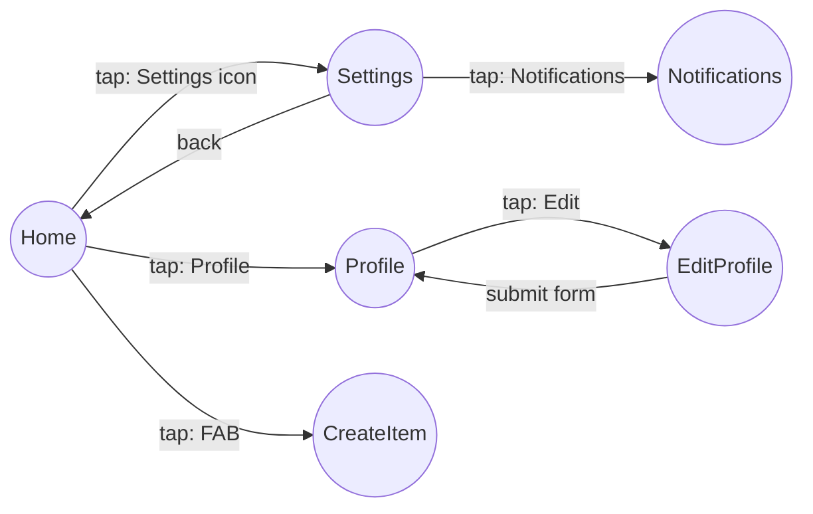
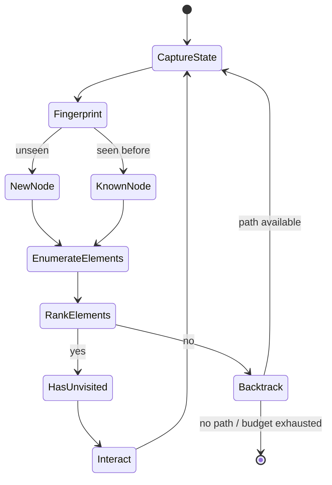

# 10 — Autonomous Exploration Engine

## Purpose

Discover as much of an app's reachable UI as possible, within a time/step budget, without a pre-written test script, and represent it as a navigation graph that every downstream stage (vision, copywriter, report) can consume.

## Prior Art Studied

| Tool | Strength taken | Weakness avoided |
|---|---|---|
| Maestro | Simple YAML flow DSL, good ADB abstraction | Requires hand-written flows — no autonomy |
| Appium | Mature cross-platform driver protocol (WebDriver-based) | Heavy setup, session model not built for autonomous graph discovery |
| UI Automator | Fast accessibility-tree access on Android | Android-only, low-level |
| Espresso | Fast, reliable in-process interaction on Android | Requires app instrumentation/compilation coupling, not black-box |

HoneyPie's explorer uses Appium/UI-Automator-style accessibility tree inspection as its interaction primitive, but replaces the "replay a fixed script" model entirely with autonomous graph-search driven by a policy (see below).

## Core Abstraction: Navigation Graph



- **Nodes** = distinct screen states, identified by a state fingerprint (accessibility tree structure hash + visible text set, not raw pixel hash, so minor animation/timestamp differences don't create false-new nodes).
- **Edges** = the interaction (tap target, gesture, form submission) that produced the transition.

## Exploration Policy

A frontier-based graph search, not a random monkey-tester:

1. Start at the launch screen; capture state, enumerate interactive elements from the accessibility tree.
2. Rank unvisited interactive elements by a heuristic priority: primary navigation elements (bottom nav, drawer, tabs) > buttons with actionable-sounding labels > list items > secondary/icon-only controls > destructive-sounding labels (deprioritized, see safety below).
3. Interact with the highest-priority unvisited element; capture resulting state; if it's a new node, add it and its edge to the graph; if it's a previously seen node, record the edge but don't re-explore from it unless it has other unvisited elements.
4. Maintain a visited-state set keyed by fingerprint to guarantee termination and avoid infinite loops (e.g., two screens that navigate to each other).
5. Backtrack (system back / navigate-to-known-path) when the current frontier is exhausted, continuing until the time/step budget is spent or the graph stabilizes (no new nodes found in N consecutive steps).



## Handling Blockers

| Blocker | Handling |
|---|---|
| OS permission dialog | Detected via known system dialog signatures; auto-accepted or auto-dismissed per config policy (default: accept benign permissions like notifications, deny risky ones like location unless configured otherwise) |
| App-level modal/popup | Detected via overlay/z-order heuristics + VLM fallback; dismissed via close affordance detection |
| Login/signup form | Filled with synthetic data (see below); if a real backend rejects synthetic credentials, explorer treats that branch as a dead end and backtracks gracefully rather than retrying indefinitely |
| Infinite loop | Visited-state fingerprinting inherently prevents true infinite loops; a step-budget-per-node cap is a secondary guard |
| Irrecoverable crash | Session restarts from launch, previously discovered graph is retained, unexplored frontier resumes |

## Synthetic Data Generation

Form fields are classified by input type + nearby label text (via accessibility tree + optional LLM classification), then filled from a fixture library (plausible names, emails using a reserved `@honeypie.example` domain, placeholder passwords meeting common complexity rules, etc.), configurable and overridable per-field in `honeypie.config.json`.

## Safety & Exclusions

- `honeypie.config.json` supports an `explorationExclusions` list (by label/route pattern) — e.g., never tap "Delete Account", never enter a "Payment" flow. These are excluded from the ranked frontier entirely, not just deprioritized.
- Exploration never performs a network-mutating action pattern it can't identify as safe by default (a conservative denylist of label keywords: delete, remove, purchase, pay, subscribe, cancel subscription) unless explicitly allow-listed.

## Output Schema — `navigation-graph.json`

```json
{
  "nodes": [
    { "id": "home", "label": "Home", "screenType": "home", "fingerprint": "a1b2c3", "capturePaths": ["raw/home-01.png"] }
  ],
  "edges": [
    { "from": "home", "to": "settings", "action": "tap", "target": "Settings icon" }
  ],
  "stats": { "nodesDiscovered": 37, "edgesTraversed": 61, "durationMs": 214300, "budgetExhausted": false }
}
```
