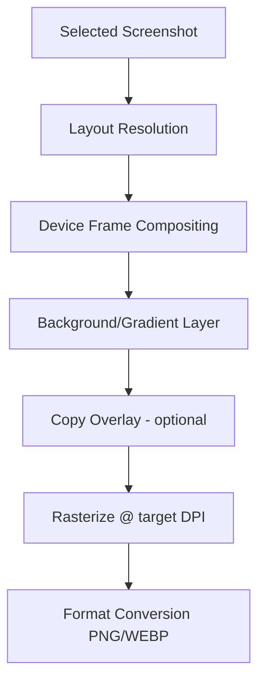

# 11 — Renderer Architecture

## Purpose

Deterministically composite selected screenshots into device mockups and store-ready graphics at exact required pixel dimensions. No AI is involved in this stage — it is pure, testable image compositing, driven by declarative templates (see `docs/13-template-system.md`).

## Rendering Pipeline



## Rendering Engine

Rendering uses a headless, GPU-accelerated 2D canvas (Skia via `skia-canvas`/`@napi-rs/canvas`, or a WASM-based pipeline for cross-platform consistency without native binary drift — see `docs/24-decision-log.md#adr-003`). All layout is expressed as declarative scene graphs (JSON/YAML), not imperative drawing code, so themes are data, not code, and can be authored by non-engineers or generated by a plugin.

## Composition Model

A render job is a scene graph:

```json
{
  "canvas": { "width": 1242, "height": 2688, "background": { "type": "gradient", "stops": ["#1a1a2e", "#16213e"] } },
  "layers": [
    { "type": "deviceFrame", "model": "iphone-15-pro", "angle": -6, "x": 120, "y": 400 },
    { "type": "screenshot", "src": "selected/settings-notifications.png", "clipTo": "deviceFrame" },
    { "type": "text", "content": "Stay on top of everything", "font": "Inter-Bold", "size": 64, "color": "#ffffff", "x": 621, "y": 220, "align": "center" }
  ]
}
```

Themes (`docs/13-template-system.md`) are libraries of scene-graph templates parameterized by screenshot + copy + brand config. A `RenderTheme` plugin's job is to take a `SelectedScreenshot` + `RenderSpec` and emit one of these scene graphs, which the shared rasterizer then executes identically regardless of theme.

## Device Frame Library

A maintained, versioned library of device frame assets (bezel PNGs/SVGs with precise screen-cutout coordinates) for current-generation iPhone, Pixel, Samsung Galaxy, and tablet form factors, stored in `packages/templates/device-frames/` with a manifest mapping model → cutout geometry. This library is updated independently of core releases (see `docs/22-release-process.md`).

## Multi-Device / Hero Compositions

Layouts supporting multiple device frames in one canvas (e.g., a hero image with 3 overlapping angled phones) are themselves scene-graph templates with multiple `deviceFrame` layers at different z-indices, offsets, and angles — no special-cased renderer code required.

## Output Fidelity Requirements

- All rendering happens at 2x–3x target resolution internally then downsamples, to avoid frame/text aliasing.
- Text rendering uses proper font metrics (via HarfBuzz shaping through the canvas backend) — no naive character-width approximation — to avoid clipped or overlapping copy overlays.
- Color management: sRGB throughout; no unintended gamma shifts between the captured screenshot and the composited output.

## Determinism

Given the same input screenshot, scene graph, and font assets, rendering output must be byte-identical across machines/OSes — enforced by `docs/17-testing-strategy.md`'s visual regression suite (pixel-diff against golden renders, zero-tolerance for the deterministic renderer, since only the *choice* of screenshot/copy is AI-influenced, not the pixels themselves).

## Performance

Render jobs are pure functions of their scene graph and are parallelized across a worker pool bounded by CPU core count; see `docs/19-performance-goals.md` for target throughput.
