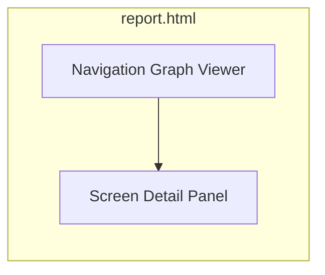

# 14 — HTML Report Specification

## Purpose

`dist/report.html` is a self-contained, offline-viewable, interactive artifact that lets a developer inspect every decision HoneyPie made — not a static summary, a direct visualization of `honeypie.json` and the intermediate stage artifacts bundled alongside it.

## Requirements

- Fully self-contained (inlined CSS/JS/images or relative paths within `dist/`) — must work via `file://` with no server.
- No external network requests (privacy — nothing phones home when a developer opens the report).
- Must render meaningfully even for a partial/degraded run (some stages failed).

## Sections

### 1. Overview
App name, framework, run timestamp, total duration, AI provider/cost summary, headline pass/fail status.

### 2. Navigation Graph
Interactive force-directed or hierarchical graph visualization (nodes = screens, edges = transitions) rendered client-side from `navigation-graph.json`. Clicking a node shows its captured screenshot(s) and screen-type classification.

### 3. Screenshot Review
Grid of all captured screenshots, filterable by `selected` / `rejected`, each showing its score breakdown (visualQuality/clutter/readability/aesthetic) and rejection reason if applicable. This is the primary trust-building surface — a developer can see *why* HoneyPie chose what it chose.

### 4. Generated Copy
Every generated headline, subtitle, caption, and description, organized by export target, with a "regenerate this" affordance that (in a future interactive mode) can trigger a targeted re-run — v1 ships this as read-only with the CLI command to copy-paste for a manual re-run.

### 5. Exported Assets
Thumbnail gallery of every file in `dist/`, grouped by target folder, with dimensions and file size, and a one-click "reveal in Finder/Explorer" link where supported.

### 6. Errors & Warnings
Any `errors[]` entries from `honeypie.json`, in plain language with remediation hints (e.g., "theme-neon failed to load: incompatible SDK version — try `honeypie plugins update theme-neon`").

### 7. Run Configuration
The exact resolved config used for the run (merged defaults + `honeypie.config.json` + CLI flags), so a run is fully reproducible/auditable.

## Data Binding

The report is a static single-page app (vanilla JS or a minimal framework, no build-time app-specific data — the same `report.html` template ships with HoneyPie itself and reads `honeypie.json` + referenced asset paths at open-time via relative fetch, avoiding a full rebuild per project).

## Accessibility

Report meets WCAG 2.1 AA: keyboard-navigable graph viewer, alt text derived from screen labels, sufficient color contrast in both light/dark report themes (report has its own light/dark toggle, independent of app mockup themes).
