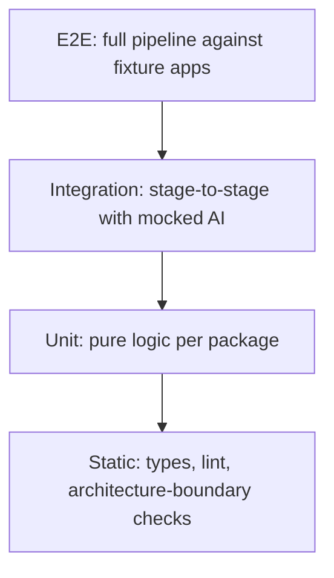

# 17 — Testing Strategy

## Test Pyramid

## Unit Tests
Every package's pure logic (config merging, scene-graph resolution, navigation-graph fingerprinting, dedup hashing, schema validation) is unit-tested in isolation with no device, no network, no AI calls. Target: >85% line coverage on `core`, `vision` (non-AI paths), `renderer`, `publisher`.

## Integration Tests
Stage-to-stage tests using recorded/mocked AI responses (via `plugin-sdk`'s test harness — see `docs/07-plugin-sdk.md`) and a pre-recorded navigation graph fixture, verifying e.g. that `vision` output correctly feeds `renderer` input without ever hitting a real device or a real AI provider. These run on every PR.

## End-to-End Tests
Full pipeline runs against real fixture apps (`examples/*`) on real emulators in CI, using a deterministic local-heuristic AI mode (`--local-only`) to keep E2E tests free of network flakiness and API cost, plus a smaller nightly job that runs a subset against real cloud providers to catch provider-integration regressions.

## Architecture-Boundary Tests
A static lint pass (dependency-cruiser or equivalent) enforces the package dependency rules in `docs/04-repository-layout.md` — e.g., fails CI if any `plugins/*` package imports from `packages/core/internal/*` rather than `plugin-sdk`.

## Visual Regression Tests
Renderer output is compared pixel-for-pixel against committed golden images for a fixed set of scene graphs (see `docs/11-renderer-architecture.md`'s determinism requirement) — zero tolerance, since rendering is deterministic; any diff is either an intentional template change (update golden) or a real regression.

## Plugin Conformance Tests
`plugin-sdk` ships a conformance test suite that any third-party plugin can run against itself (`honeypie-plugin-test conformance`) to verify it correctly implements its declared interface before publishing — this is how HoneyPie keeps a healthy plugin ecosystem without manually reviewing every plugin's internals.

## Fixture Apps

`examples/` contains three maintained fixture apps (Flutter, React Native, native Android/Compose) specifically designed to exercise: navigation depth, forms, permission dialogs, modals, empty states, and dark/light theming — these are the backbone of both E2E tests and the quality benchmarks in `docs/16-benchmarking-strategy.md`.

## CI Gates

| Gate | Blocking on |
|---|---|
| Static + Unit | every PR |
| Integration | every PR |
| Architecture-boundary | every PR |
| Visual regression | every PR touching `renderer`/`templates` |
| E2E (local-only mode) | every PR touching `builder`/`explorer`/`vision`/`publisher` |
| E2E (real providers) | nightly, not PR-blocking |
| Performance benchmarks | every PR touching perf-sensitive packages, regression >15% blocks merge |

See `docs/22-release-process.md` for how these gates map to release branches.
