# 23 — Milestone Roadmap

## Sequencing Rationale

Android-first, Flutter-and-native-first, is the initial focus: Android emulators are scriptable without paid tooling (unlike iOS Simulator automation, which has more friction outside Xcode's ecosystem), and Flutter + native Android/Compose together cover a large share of early adopters. React Native/Ionic/Expo support follows once the exploration engine's core abstractions are proven, since those frameworks mostly render into the same underlying native views the accessibility tree already understands. iOS support (Simulator automation, App Store export target) follows Android.

## Phase 0 — Research & Specification (this document set)
- Deliverable: this `/docs` folder.
- Exit criteria: architecture reviewed, interfaces frozen enough to start Phase 1 implementation.

## Phase 1 — Core Skeleton & Android/Flutter Path
- `core` orchestrator, plugin registry, config system, AI gateway (with local-only fallback mode functional first, cloud providers second).
- `builder`: Flutter + native Android/Compose detectors, build, ADB device/emulator lifecycle.
- `explorer`: frontier-based exploration policy, navigation graph, basic dialog/permission handling.
- `vision`: rule-based filtering + local-heuristic scoring; VLM scoring as an upgrade path once gateway is stable.
- CLI (`run`, `doctor`, `config init`) — TUI deferred to Phase 2.
- Exit criteria: `honeypie run --local-only` produces a real `dist/` (unframed screenshots + basic metadata) against all three fixture-app categories relevant to this phase.

## Phase 2 — Rendering, Copy, and the Full v1 Pipeline
- `renderer` + `templates`: all seven first-party themes, device frame library (Android + iPhone frames).
- `copywriter`: cloud LLM path + templated fallback.
- `publisher`: full `dist/` structure, `honeypie.json`, `report.html`.
- `tui`: full interactive experience per `docs/06-tui-specification.md`.
- Export targets: Play Store, README, Website, Open Graph, Social.
- Exit criteria: performance and quality benchmarks (`docs/16-benchmarking-strategy.md`) met on all three fixture apps; `honeypie` (zero-arg) works end-to-end on a real third-party Flutter app in a public dogfood test.

## Phase 3 — Plugin Ecosystem & Framework Breadth
- Public `plugin-sdk` release + conformance test kit.
- React Native, Ionic, Expo detectors.
- Community theme/export-target plugin onboarding (documentation, examples, plugin registry listing).
- Exit criteria: at least one community-contributed plugin merged and published independently of the core team.

## Phase 4 — iOS & App Store Path
- iOS Simulator build/launch/install path.
- App Store export target, iPhone/iPad device frame set.
- Exit criteria: `honeypie run --outputs appstore` produces store-ready assets on a real iOS fixture app.

## Phase 5 — Press Kit, Video, and Beyond
- Press kit export target completion.
- Promotional video generation (screen-recording during exploration + AI-assisted edit, see `docs/26-future-ideas.md`).
- Marketing website generation.
- Exit criteria: defined per-feature in `docs/26-future-ideas.md` as each is scoped in detail.

```mermaid
gantt
    title HoneyPie Roadmap (relative sequencing, not calendar-committed)
    dateFormat  X
    axisFormat %s
    section Phase 0
    Research & Spec           :done, p0, 0, 1
    section Phase 1
    Core skeleton (Android/Flutter) :p1, 1, 3
    section Phase 2
    Rendering + Copy + Full v1 :p2, 3, 5
    section Phase 3
    Plugin ecosystem + breadth :p3, 5, 6
    section Phase 4
    iOS + App Store            :p4, 6, 8
    section Phase 5
    Press kit + video + beyond :p5, 8, 10
```

## What Blocks What

- Phase 2's `renderer` depends on Phase 1's `vision` producing selected screenshots — but `renderer`/`templates` scaffolding (theme authoring, device frame library work) can start in parallel with late Phase 1, since it only needs *fixture* screenshots, not a working `vision` stage.
- Phase 3's plugin ecosystem work depends on `plugin-sdk` interfaces being frozen, which realistically happens once Phase 2's real usage has exercised them — freezing too early risks a breaking v2 SDK immediately after v1.
- Phase 4 (iOS) is intentionally sequenced after Phase 3, not before, because iOS Simulator automation tooling is more brittle and would slow down proving out the core exploration/vision/render loop if tackled first.
